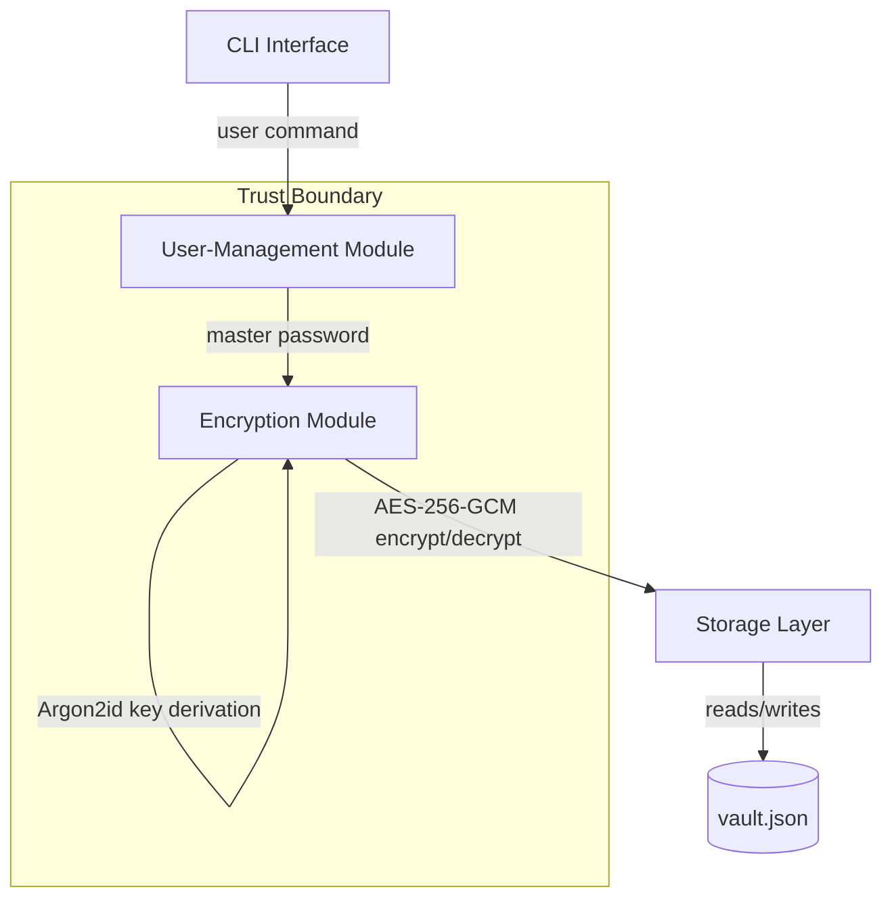

# Architecture

## Components

- **CLI Interface** — accepts user commands (add, get, list, delete). Untrusted input enters here.
- **User-Management Module** — verifies the master password, unlocks/locks the vault session.
- **Encryption Module** — derives the key from the master password via Argon2id, encrypts/decrypts vault entries with AES-256-GCM.
- **Storage Layer** — reads and writes `vault.json` to disk. Only ever handles ciphertext, never plaintext.

## Data flow
1. User enters a command + master password via the CLI.
2. User-Management Module verifies the password against a stored hash.
3. Encryption Module derives the key (Argon2id) and encrypts/decrypts the requested entry.
4. Storage Layer persists the encrypted vault to disk.

## Trust boundary
Everything inside "Trust Boundary" only ever holds the decrypted key/data in memory, and only while the vault is unlocked. The Storage Layer and the disk itself are **outside** the trust boundary — assume an attacker can read `vault.json` directly.
